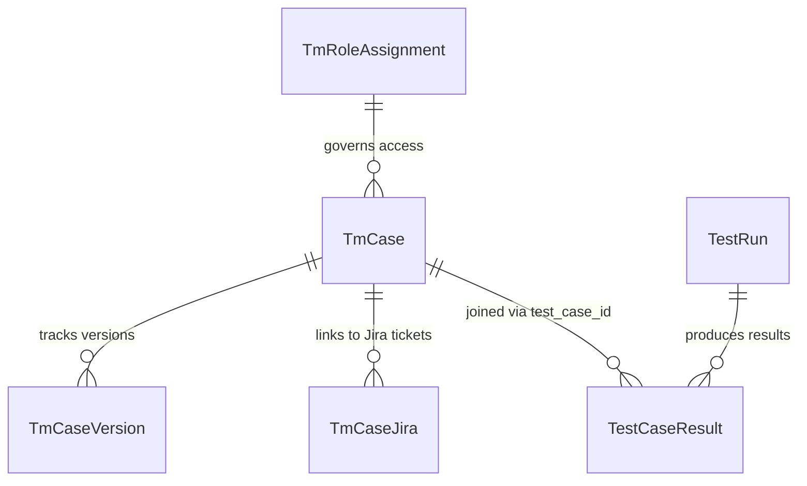

# TCMS Implementation Summary

## 1. Executive Summary

The Test Case Management System (TCMS) for the Rewards automated test suite has been implemented inside the existing `trigger-service` codebase according to the requirements specified in `TCMS_PRD.pdf`.

The system introduces a central test case repository, immutable version auditing ($N+1$), bi-directional Jira ticket traceability, zero-import static AST test suite scanning, targeted pytest execution by Case ID, per-case execution histories, compliance CSV/JSON reporting, and an AI export interface, while preserving complete isolation from legacy trigger tables and database write pipelines.

---

## 2. Architecture & Data Model

### Database Isolation
All new tables use the strict `Tm` prefix to prevent collision with legacy `Tcms*` tables or `TestRun`/`TestCaseResult` write pipelines:
- **`TmCase`**: Master test case catalog containing Case ID, platform, title, functional area, source path/symbol, hygiene status, business rules, expected results, version, and timestamps.
- **`TmCaseVersion`**: Immutable historical audit log. Every update to a test case creates an $N+1$ version row with the complete snapshot, editor email, and change summary.
- **`TmCaseJira`**: Many-to-many Jira ticket mapping table with soft-delete (`removed_at`) and audit traceability (`link_kind`, `linked_by`, `linked_at`).
- **`TmRoleAssignment`**: Role-based access control table mapping user email addresses to roles (`viewer`, `editor`, `admin`).

### Contiguous Schema Migrations
The migration sequence is strictly ordered and contiguous:
- `001_initial_schema.sql` through `007_add_slack_notifications.sql` (Existing baseline)
- `008_tm_case.sql`
- `009_tm_case_version.sql`
- `010_tm_case_jira.sql`
- `011_tm_role_assignment.sql`

All migrations contain strictly `CREATE TABLE IF NOT EXISTS` statements with no destructive `ALTER TABLE` operations.

---

## 3. Implemented Capabilities by Phase

### Phase 1: Foundations & Startup Guard
- Enforced strict local MySQL port `3307`. Host port `3306` (running live `mysqld`) is protected.
- Fail-fast startup guard in [`app/main.py`](file:///c:/Users/HP/OneDrive/Desktop/TCMS/app/main.py) and connection checker in [`app/services/db.py`](file:///c:/Users/HP/OneDrive/Desktop/TCMS/app/services/db.py) abort execution if `TRIGGER_DEV_AUTH=true` attempts to target port `3306`.
- Schema runner registered in [`app/services/schema.py`](file:///c:/Users/HP/OneDrive/Desktop/TCMS/app/services/schema.py).

### Phase 2: Core TCMS Store & API
- Comprehensive data access layer in [`app/services/tcms_store.py`](file:///c:/Users/HP/OneDrive/Desktop/TCMS/app/services/tcms_store.py).
- REST endpoints in [`app/routes/tcms.py`](file:///c:/Users/HP/OneDrive/Desktop/TCMS/app/routes/tcms.py):
  - `GET /api/tcms/cases` (Multi-field filtering: area, status, search, jira_key, pagination)
  - `GET /api/tcms/cases/{case_id}`
  - `PATCH /api/tcms/cases/{case_id}` (Editor-only; creates version snapshot $N+1$)
  - `GET /api/tcms/cases/{case_id}/versions`
- RBAC dependencies in [`app/dependencies.py`](file:///c:/Users/HP/OneDrive/Desktop/TCMS/app/dependencies.py) enforcing Viewer, Editor, and Admin permissions.

### Phase 3: Static AST Test Scanner
- Implemented [`scripts/tcms_scan.py`](file:///c:/Users/HP/OneDrive/Desktop/TCMS/scripts/tcms_scan.py) using Python's `ast` module.
- Never imports test files, never executes tests, and never connects to any database.
- Discovers test IDs via `@pytest.mark.parametrize` (`ids` parameter or `test_case_id` argument) and docstring descriptions (`@tcms_id:` or leading regex patterns).
- Computes hygiene flags: `is_unique`, `is_shared`, `is_ambiguous`, and `substring_unsafe`.

### Phase 4: Import Pipeline
- Endpoint `POST /api/tcms/import` (Admin-only).
- Batch ingestion preserves existing manual customizations (business rules, steps, expected results) while updating static source anchors, skipped status, and hygiene classifications.

### Phase 5: Web UI & Server-Side Templates
- Jinja2 template views under [`app/routes/tcms_ui.py`](file:///c:/Users/HP/OneDrive/Desktop/TCMS/app/routes/tcms_ui.py):
  - `/tcms`: Catalog listing with search, area, status, and Jira filters.
  - `/tcms/{case_id}`: Full detail page with steps, rules, versions, execution history, and "Run this case" trigger widget.
  - `/tcms/{case_id}/edit`: Editor interface for updating specifications with change summary.
- Global template helpers: Inline SVG favicon, HTML escaping, date formatting, and user role pills.

### Phase 6: Jira Linking & Filtering
- Endpoints:
  - `POST /api/tcms/cases/{case_id}/jira`
  - `DELETE /api/tcms/cases/{case_id}/jira/{jira_key}` (Soft delete)
  - `POST /api/tcms/jira/bulk` (Bulk linking from pasted Case IDs)
- Strict regex validation: `^[A-Z][A-Z0-9]+-\d+$`.
- Filtering `/tcms` catalog by Jira key with 1-click unlink / relink support.

### Phase 7: Run Single / Targeted Test Cases
- Enhanced `POST /api/trigger` in [`app/routes/trigger.py`](file:///c:/Users/HP/OneDrive/Desktop/TCMS/app/routes/trigger.py):
  - Accepts `test_case_ids: List[str]` (max 20 IDs).
  - Validates ID syntax (`^[A-Za-z0-9][A-Za-z0-9_.-]{2,99}$`).
  - Restricts execution to the `rewards` platform.
  - Refuses execution if any target ID has `id_status == 'ambiguous'`.
  - Enforces active environment leasing (returns `HTTP 409` on conflict).
  - Dispatches targeted runs with runner payload and pytest `-k` fallback (unless `substring_unsafe`).

### Phase 8: Runner Hook Integration
- Implemented [`scripts/runner_plugin.py`](file:///c:/Users/HP/OneDrive/Desktop/TCMS/scripts/runner_plugin.py).
- Pytest hook `pytest_collection_modifyitems` filters collected test items against `TCMS_TARGET_CASE_IDS` with exact boundary matching to prevent prefix collisions.

### Phase 9: Execution History & Compliance Reporting
- Endpoint `GET /api/tcms/cases/{case_id}/executions` joining `TestCaseResult` and `TestRun`.
- Compliance report endpoints:
  - `GET /api/tcms/jira/{jira_key}/report` (JSON)
  - `GET /api/tcms/jira/{jira_key}/report.csv` (CSV download for Jira attachments)
- Dual-section compliance view:
  1. Linked TCMS test cases with latest outcomes across environments (`pre-prod`, `staging`, `prod`) and runner image digests.
  2. Runs under the ticket containing test results with no test case ID (legacy coverage audit).
- Read-only AI context export:
  - Endpoint `GET /api/tcms/export.json`
  - CLI script [`scripts/export_tcms_for_ai.py`](file:///c:/Users/HP/OneDrive/Desktop/TCMS/scripts/export_tcms_for_ai.py)

### Phase 10: Operational Hardening & Documentation
- Comprehensive documentation:
  - [`docs/RUNBOOK.md`](file:///c:/Users/HP/OneDrive/Desktop/TCMS/docs/RUNBOOK.md): Operations, port 3307 instructions, safety guards, and incident handling.
  - [`docs/QA_GUIDE.md`](file:///c:/Users/HP/OneDrive/Desktop/TCMS/docs/QA_GUIDE.md): End-to-end user manual for QA engineers.
  - [`docs/HOW_TO_ADD_A_TEST_CASE.md`](file:///c:/Users/HP/OneDrive/Desktop/TCMS/docs/HOW_TO_ADD_A_TEST_CASE.md): Pytest authoring conventions, parametrization rules, and static scanner usage.
  - [`docs/IMPLEMENTATION_SUMMARY.md`](file:///c:/Users/HP/OneDrive/Desktop/TCMS/docs/IMPLEMENTATION_SUMMARY.md): Architecture and external dependency roadmap.

### Phase 11: Stretch - Tamper-Evident Audit Log & Jira Audit Pack
- Migration `012_tm_audit_event.sql`: Creates `TmAuditEvent` table.
- Implemented [`app/services/tcms_audit.py`](file:///c:/Users/HP/OneDrive/Desktop/TCMS/app/services/tcms_audit.py):
  - SHA-256 hash chaining linking each event to the previous event (`prev_hash` -> `event_hash`).
  - Automatic audit recording for case creation, case update, Jira linking/unlinking, role assignments, and imports.
  - `verify_audit_chain()` verifies chain validity and pinpoints any illegally modified, tampered, or deleted rows.
  - `generate_jira_audit_pack(jira_key)` produces a sealed, self-verifying SOC 2 Type II audit pack with specifications, historical version diffs, execution evidence, audit events, and canonical pack digest signature.
- Endpoints:
  - `GET /api/tcms/audit/verify`
  - `GET /api/tcms/jira/{jira_key}/audit-pack`
  - `GET /api/tcms/cases/{case_id}/audit-trail`

---

## 4. Verification & Test Suite Parity

The implementation includes 70 comprehensive unit and integration tests running against a hermetic in-memory test double in [`tests/conftest.py`](file:///c:/Users/HP/OneDrive/Desktop/TCMS/tests/conftest.py):

| Test Module | Test Count | Status |
| :--- | :---: | :---: |
| `tests/test_startup_guard.py` | 4 | PASSED |
| `tests/test_migrations.py` | 5 | PASSED |
| `tests/test_tcms_store.py` | 8 | PASSED |
| `tests/test_tcms_api.py` | 7 | PASSED |
| `tests/test_scanner.py` | 4 | PASSED |
| `tests/test_tcms_ui.py` | 6 | PASSED |
| `tests/test_template_helpers.py` | 3 | PASSED |
| `tests/test_favicon.py` | 1 | PASSED |
| `tests/test_jira_linking.py` | 6 | PASSED |
| `tests/test_run_by_id.py` | 8 | PASSED |
| `tests/test_runner_hook.py` | 5 | PASSED |
| `tests/test_execution_history_and_csv.py` | 3 | PASSED |
| `tests/test_ai_export.py` | 2 | PASSED |
| `tests/test_audit_trail_and_pack.py` | 7 | PASSED |
| `tests/test_config_reaches_the_pod.py` | 1 | PASSED |
| **Total** | **70** | **100% PASSED** |

---

## 5. External Dependencies & Next Steps

While the TCMS service within `trigger-service` is fully implemented and tested, end-to-end execution of targeted test runs inside Kubernetes/Argo requires the following configuration in the companion repository `platform_svc_test-suite`:

1. **Install Runner Plugin**:
   Copy or reference [`scripts/runner_plugin.py`](file:///c:/Users/HP/OneDrive/Desktop/TCMS/scripts/runner_plugin.py) inside `platform_svc_test-suite` root `conftest.py` or register it via `pytest11` entrypoint in `pyproject.toml`.
2. **Rebuild Runner Container Image**:
   Rebuild the Docker container image for the Rewards test runner to include the plugin and push to the internal container registry.
3. **Update Argo Workflow Definition**:
   Ensure the Argo Workflow template receives `TCMS_TARGET_CASE_IDS` from the launch parameters passed by `run_launch.py` and maps it to the container's environment variables.
